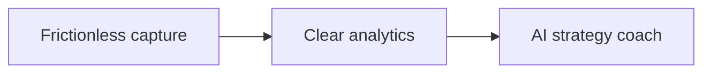

# Product thinking — Golf Lab

This document explains **why** Golf Lab exists and **how** product choices show up in the app. 

Doc set and scope: [README § How this repo is documented](../README.md#how-this-repo-is-documented).

---

## One-liner

**Cut through the noise to improve your on-course scoring.**

---

## Context

| Dimension             | Choice                                                                                  |
| --------------------- | --------------------------------------------------------------------------------------- |
| **Built for**         | Owner-operated daily use; **production-ready** (sync, reliability, field-tested UX)     |
| **Design lens**       | [Committed recreational golfer](ICP.md) (ICP v1.0) — persona-driven decisions           |
| **Commercialization** | None                                                                                    |
| **Horizon**           | Near-term: tracking + analytics; next layer: **AI strategy coach** on top of owned data |

Detailed problem framing: [Problems & positioning](PROBLEMS.md) (v1.0).

---

## Vision (phased)

1. **Now — Capture** — Log rounds on Watch (primary) and iPhone with minimal taps; practice logging and weekly targets.
2. **Now — Understand** — Home and Stats show trends on metrics tied to scoring (vs par, GIR, FIR, putts, penalties where tracked).
3. **Next — Coach** — AI tab delivers **on-course strategy from the user's stats**, not swing rebuilds (tab is positioned; implementation follows data depth).

Explicitly **not** in vision: swing analytics, GPS/shot guidance, commercial growth features.

---

## Jobs to be done (priority order)

| Priority | Job                                           | How the app serves it                                                                             |
| -------- | --------------------------------------------- | ------------------------------------------------------------------------------------------------- |
| 1        | **Frictionless round logging on-course**      | Watch-primary hole entry; large tap targets; auto-advance on save; iPhone for setup and backup    |
| 2        | **See trends that explain long-term scoring** | Home quick stats + charts; Stats tab for deeper season views; restrained metric set               |
| 3        | **Hit weekly goals**                          | Configurable round + practice targets; streak UI; **streak completion** as primary success metric |

---

## Product principles

- **On-course speed over off-course depth** — Fewest taps/clicks on every surface; validate changes against hole-entry flow first.
- **Clarity over density** — Fewer metrics that matter; avoid dashboard sprawl (see tension in [future-todos](future-todos.md) for advanced Stats ideas).
- **Data tool, not sports entertainment** — Light, green-tinted, analytical aesthetic; no gamified fitness patterns.
- **Watch when playing, phone when reflecting** — Active round pushes users to Watch; tab bar switches to Round when a round is active.
- **Earn the next layer** — AI coach waits on trustworthy analytics foundation, not the other way around.

---

## Out of scope (explicit)

| Area                                        | Stance     | Possible future exception |
| ------------------------------------------- | ---------- | ------------------------- |
| Swing / video analytics                     | No         | —                         |
| GPS / rangefinder / per-shot phone guidance | No         | —                         |
| Handicap index officialization              | No for now | Maybe later               |
| Social, leagues, marketplace                | No         | —                         |
| Commercialization / multi-tenant            | No         | —                         |

---

## Success metric

**Weekly goals streak completion** — consecutive calendar weeks where active round and practice targets are both met.

Why this metric for an owner-operated app: it measures whether the product drives **repeatable behavior** (play + practice), not vanity installs or one-off round logs.

Secondary signals (not primary KPIs): rounds logged per week, practice sessions logged.

---

## Product surface map

| Tab / area  | Role                                                                                                                       |
| ----------- | -------------------------------------------------------------------------------------------------------------------------- |
| **Home**    | Season snapshot, quick stats, weekly goals & streak, scoring trend, recent rounds; profile entry (not a tab); log practice |
| **Round**   | New round setup, hole entry (iPhone), end round; auto-selected when round active                                           |
| **Stats**   | Season-filtered trends (vs par, GIR, FIR, putts, etc.)                                                                     |
| **History** | Round list, calendar, round detail / scorecard, hole edit, practice history                                                |
| **AI**      | Strategy coach positioning ("score better from your stats"); coming soon                                                   |

**watchOS** — Active round: hole number, score/putts steppers, GIR/FIR/penalty, save hole; syncs with iPhone via Watch Connectivity.

---

## Tradeoffs

Each entry documents **what we chose**, **what we gave up**, and **what would change the decision**.

### 1. Platform — Apple on-course stack

**Chose:** Native **iOS + watchOS**, Watch as primary during play.

**Over:** Web, Android, or phone-only logging.

**Because:** On-course use is physical—wrist logging beats pulling a phone out every hole; Watch Connectivity keeps one active round across devices.

**Cost:** Apple ecosystem only; two targets to maintain; Watch reachability edge cases.

**Revisit if:** Daily driver platform changes or Watch is no longer worn during rounds.

---

### 2. AI — Analytics first, coach second

**Chose:** Full **tracking and analytics** before **AI strategy coach**; coach messaging emphasizes scoring strategy from *user* stats, not swing fixes.

**Over:** Launching AI early with thin data, or swing-coaching positioning.

**Because:** Strategy recommendations need trustworthy, owned round history; the AI tab is a deliberate placeholder until the data layer earns trust.

**Cost:** "AI" tab visible before value ships; risk of perceived vaporware without clear "coming soon" framing.

**Revisit when:** Enough labeled rounds exist to test useful strategy prompts (season trends, miss patterns, penalty rates).

---

### 3. Data entry — Structured holes, minimum friction

**Chose:** Per-hole **score, putts, GIR, FIR, penalty** with steppers and toggles optimized for tap count—not shot-by-shot or GPS traces.

**Over:** Score-only (too little for trends) or rich shot logging (too slow on-course).

**Because:** Committed improvers need GIR/FIR/putts/penalty signals for scoring diagnosis without Arccos-level hardware or caddie-app flow.

**Cost:** More taps than "total score only"; validation edge cases (see [future-todos](future-todos.md) — GIR/FIR guardrails).

**Revisit if:** Field testing shows a field can drop with no loss to streak or trend quality—or penalty/hazard model needs more granularity.

---

### 4. Aesthetic — Analytical dashboard, light-only

**Chose:** **Light-first**, green-tinted surfaces, IBM Plex typography, single accent, score semantic colors only on score displays—closer to a data tool than a sports app.

**Over:** Dark mode, gamification, leaderboard visuals, multi-accent sports UI.

**Because:** Primary use is **outdoors in sunlight**; legibility and calm density beat theme flexibility and excitement chrome.

**Cost:** No dark mode for low-light off-course review; distinctive "golf app" look sacrificed for clarity.

**Revisit if:** Usage shifts predominantly to indoor analysis (unlikely for stated ICP).

---

### 5. Scope — Personal production app, not a product company

**Chose:** **Owner-operated**, no commercialization, no social graph—still **production-ready** sync and polish.

**Over:** Multi-tenant SaaS, App Store growth features, friend comparisons.

**Because:** Goal is scoring improvement for daily use, not market validation; scope guardrails prevent feature creep into GPS/social/swing categories.

**Cost:** Architecture may be "heavier than needed" for one operator (auth, Supabase); docs and onboarding don't target strangers.

**Revisit if:** Intent changes to ship for others (would force ICP, onboarding, privacy, and support model rewrite).

---

### Supporting tradeoff — Auth & data sync

**Chose:** **Supabase-backed** persistence and auth; **minimal profile** (initials/avatar on Home only, no Profile tab).

**Over:** Local-only storage or rich profile product.

**Because:** Production-ready means data survives device loss and enables future coach features; profile is not a job-to-be-done for a solo user.

**Cost:** Operational dependency on Supabase; auth is necessary plumbing, not the emotional core of the product.

**Revisit if:** Offline-first solo use becomes sufficient or profile expands (handicap, goals history export, etc.).

---

## UX priorities (on-course vs off-course)

| Context                            | Priority                                                                                   |
| ---------------------------------- | ------------------------------------------------------------------------------------------ |
| **On-course (Watch, then iPhone)** | Speed of hole entry; largest tap targets; no secondary flows mid-hole                      |
| **Off-course**                     | Scannable trends; fewer metrics; charts that explain direction, not exhaustive exploration |

Design system authority: [design.md](design.md) (principles and tokens), [DESIGN_REFERENCE.md](DESIGN_REFERENCE.md) (SwiftUI implementation).

---

## Roadmap pointer

Non-committed ideas and open decisions: [future-todos.md](future-todos.md) (public backlog—9 vs 18 filters, round summary depth, advanced Stats layout, etc.).

---

## What this doc is for in a portfolio

1. A **real problem** (personal scoring, noise reduction) — expanded in [PROBLEMS.md](PROBLEMS.md).
2. **Product thinking** — phased vision, prioritized jobs, explicit out-of-scope.
3. **Tradeoffs** — not just shipped features, but rejected alternatives and costs.

The codebase and design docs carry the "how"; this file carries the "why."